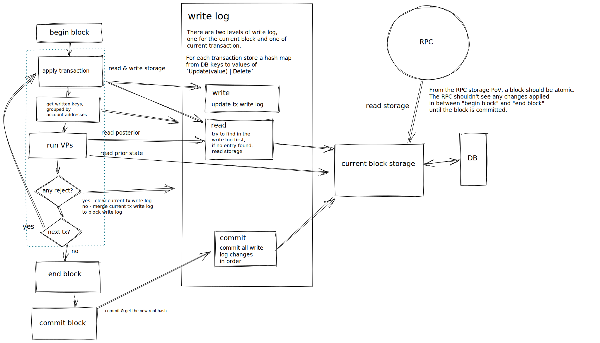

# WASM VM

A wasm virtual machine will be used for [validity predicates](./vp.md) and [transactions code](./tx-execution.md). 

The VM should provide:
- an interface for compiling from higher-level languages to wasm (initially only Rust)
- a wasm compiler, unless we use [an interpreted runtime](/explore/libraries/wasm.md)
- provide and inject [environments for higher-level languages for VPs and transactions](#wasm-environment)
- pre-process wasm modules
  - check & sanitize modules
  - inject gas metering
  - inject stack height metering
- a runner for VPs and transactions code
- encode/decode wasm for transfer & storage
- [manage runtime memory](#wasm-memory)
- wasm development helpers
- helpers to estimate gas usage
- VM and environment versioning

Needs more info:
- TODO: review [wasmer gas metering](https://github.com/wasmerio/wasmer/blob/1ee7b4a07ff1acaec93078e618d64c810e7691f0/examples/metering.rs), are there any loop-holes that could potentially escape metering?
- TODO: can VPs be pre-compiled/cached?

## Resources

- [WebAssembly Specifications](https://webassembly.github.io/spec/)
- [wasmer examples](https://docs.wasmer.io/integrations/examples)
- [The WebAssembly Binary Toolkit](https://github.com/webassembly/wabt/)
  - bunch of useful wasm tools (e.g. `wasm2wat` to convert from wasm binary to human-readable wat format) 
- [Rust wasm WG](https://github.com/rustwasm/team) and [wasm book](https://rustwasm.github.io/book/introduction.html) (some sections are JS specific)
- [A practical guide to WebAssembly memory](https://radu-matei.com/blog/practical-guide-to-wasm-memory/) modulo JS specific details

## Wasm environment

The wasm environment will most likely be libraries that provide APIs for the wasm modules.

### Common environment

The common environment of VPs and transactions APIs:

- math & crypto
- logging
- panics/aborts
- gas metering
- storage read-only API
- context API (chain metadata such as block height)

The accounts sub-space storage is described under [accounts' dynamic storage sub-space](./accounts.md#dynamic-storage-sub-space).

### VPs environment

Because VPs are stateless, everything that's exposed in the VPs environment should be read-only:

- storage API to account's sub-space the [storage write log](#storage-write-log)
- transaction API

### Transactions environment

- storage write access for all public state via the [storage write log](#storage-write-log)

Some exceptions as to what can be written are given under [transaction code](./tx-execution.md#tx-code).

## Wasm memory

The wasm memory allows to share data bi-directionally between the host (Rust shell) and the guest (wasm) through a [wasm linear memory instance](https://webassembly.github.io/spec/core/exec/runtime.html#syntax-meminst).

Because [wasm currently only supports basic types](https://webassembly.github.io/spec/core/syntax/types.html), we need to choose how to represent more sophisticated data in memory.

The options on how the data can be passed through the memory are:
- using ["C" structures](https://doc.rust-lang.org/nomicon/other-reprs.html#reprc) (probably too invasive because everything in memory would have to use C repr)
- (de)serializing the data with some encoding (JSON, binary, ...?)
- currently very unstable: [WebIDL](https://developer.mozilla.org/en-US/docs/Glossary/WebIDL) / [Interface Types](https://github.com/WebAssembly/interface-types/blob/master/proposals/interface-types/Explainer.md) / [Reference types](https://github.com/WebAssembly/reference-types)

The choice should allow for easy usage in wasm for users (e.g. in Rust a bindgen macro on data structures, similar to [wasm_bindgen used for JS <-> wasm](https://github.com/rustwasm/wasm-bindgen)).

Related [wasmer issue](https://github.com/wasmerio/wasmer/issues/315).

We're currently using borsch for storage serialization, which is also a good option for wasm memory. 
- it's easy for users (can be derived)
- because borsch encoding is safe and consistent, the encoded bytes can also be used for Merkle tree hashing
- good performance, although it's not clear at this point if that may be negligible anyway

### The data

The data being passed between the host and the guest in the order of the execution:

- For transactions:
  - host-to-guest: pass tx.data to tx code call
  - guest-to-host: parameters of environment functions calls, including storage modifications (pending on storage API)
  - host-to-guest: return results for host calls
- For validity predicates:
  - host-to-guest: pass tx.data, prior and posterior account storage sub-space state and/or storage modifications (i.e. a write log) for the account
  - guest-to-host: parameters of environment function calls
  - host-to-guest: return results for host calls
  - ~~guest-to-host~~: the VP result (`bool`) can be passed directly from the call

### Storage write log

The storage write log gathers any storage updates (`write`/`delete`s) performed by transactions. For each transaction, the write log changes must be accepted by all the validity predicates that were triggered by these changes.

A validity predicate can read its prior state directly from storage as it is not changed by the transaction directly. For the posterior state, we first try to look-up the keys in the write log to try to find a new value if the key has been modified or deleted. If the key is not present in the write log, it means that the value has not changed and we can read it from storage.

The write log of each transaction included in a block and accepted by VPs is accumulated into the block write log. Once the block is committed, we apply the storage changes from the block write log to the persistent storage.

<https://excalidraw.com/new#room=333e1db689b083669c80,Y0i8yhvIAZCFICs753CSuA>

## Gas metering

The two main options for implementing gas metering within wasm using wasmer are:
- a [gas metering middleware included in wasmer](https://github.com/wasmerio/wasmer/tree/72d47336cc1461d63baa2322b38c4cb5f67bb72a/lib/middlewares).
- <https://crates.io/crates/pwasm-utils>

Both of these allow us to assign a gas cost for each wasm operation.

`wasmer` gas middleware is more recent, so probably more risky. It injects the gas metering code into the wasm code, which is more efficient than host calls to a gas meter.

`pwasm-utils` divides the wasm code into metered blocks. It performs host call with the gas cost of each block before it is executed. The gas metering injection is linear to the code size.

The `pwasm-utils` seems like a safer option to begin with (and we'll probably need to use it for [stack height metering](#stack-height-metering) too). We can look into switching to `wasmer` middleware at later point.

## Stack height metering

TODO We'll probably need to use `pwasm-utils`, at least until this PR is merged <https://github.com/wasmerio/wasmer/pull/1037>.
